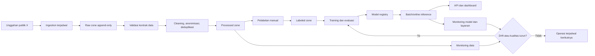

# Kuping Negara

Fondasi proyek **Machine Learning Operations (MLOps)** untuk memantau sentimen
publik pada platform X terhadap empat program prioritas pemerintah Indonesia:
Makan Bergizi Gratis (MBG), Cek Kesehatan Gratis (CKG), Koperasi Desa Merah
Putih, dan Sekolah Rakyat.

> **Status proyek:** tahap fondasi/repository setup. Struktur, lingkungan
> pengembangan, kontrak data awal, pemeriksaan environment, tes dasar, dan CI
> telah disiapkan. Pipeline pengumpulan data, pelatihan model, API, dashboard,
> orchestration, serta monitoring masih berada pada roadmap dan belum boleh
> dianggap sebagai sistem produksi.

## Daftar isi

- [Latar belakang](#latar-belakang)
- [Tujuan dan ruang lingkup](#tujuan-dan-ruang-lingkup)
- [Program yang dipantau](#program-yang-dipantau)
- [Gambaran alur MLOps](#gambaran-alur-mlops)
- [Arsitektur yang direncanakan](#arsitektur-yang-direncanakan)
- [Struktur repository](#struktur-repository)
- [Mulai cepat](#mulai-cepat)
- [Konfigurasi](#konfigurasi)
- [Rencana data](#rencana-data)
- [Rencana machine learning](#rencana-machine-learning)
- [API dan dashboard yang direncanakan](#api-dan-dashboard-yang-direncanakan)
- [Monitoring dan retraining](#monitoring-dan-retraining)
- [Pengujian dan CI](#pengujian-dan-ci)
- [Workflow Git](#workflow-git)
- [Target keberhasilan](#target-keberhasilan)
- [Etika, privasi, dan batas interpretasi](#etika-privasi-dan-batas-interpretasi)
- [Roadmap](#roadmap)
- [Lisensi](#lisensi)

## Latar belakang

Percakapan publik di media sosial bergerak cepat, menggunakan ragam bahasa yang
dinamis, dan dapat mengalami perubahan topik maupun distribusi sentimen. Kuping
Negara dirancang sebagai studi MLOps agar proses pengumpulan data, validasi,
pelabelan, pelatihan, deployment, dan monitoring dapat dilakukan secara
terjadwal, dapat ditelusuri, dan dapat direproduksi.

Proyek ini berfokus pada pembangunan proses teknis yang bertanggung jawab.
Hasilnya bukan survei opini publik dan tidak dapat digeneralisasikan sebagai
representasi seluruh warga Indonesia.

## Tujuan dan ruang lingkup

Tujuan utama:

1. mengumpulkan unggahan publik yang relevan secara berkala;
2. membersihkan, menganonimkan, dan memvalidasi data secara konsisten;
3. mengklasifikasikan sentimen menjadi `positive`, `neutral`, atau `negative`;
4. menyertakan confidence dan probabilitas kelas untuk mendukung interpretasi;
5. menjaga versioning data, model, skema, konfigurasi, dan run pipeline;
6. menyajikan tren melalui API dan dashboard yang mudah dipahami;
7. mendeteksi penurunan kualitas, drift, atau kegagalan pipeline;
8. menyediakan jalur retraining yang terkontrol dan dapat diaudit.

Di luar ruang lingkup tahap awal:

- menarik kesimpulan kausal tentang keberhasilan program;
- mengidentifikasi atau membuat profil individu;
- menganalisis pesan privat atau data yang tidak memiliki izin akses;
- deployment produksi sebelum evaluasi keamanan, kualitas, dan tata kelola.

## Program yang dipantau

| Kode | Program | Jadwal pengumpulan awal |
| --- | --- | --- |
| `mbg` | Makan Bergizi Gratis | Senin |
| `ckg` | Cek Kesehatan Gratis | Selasa |
| `kopdes_merah_putih` | Koperasi Desa Merah Putih | Rabu |
| `sekolah_rakyat` | Sekolah Rakyat | Kamis |

Pelabelan dan pemeriksaan kualitas awal direncanakan setiap Jumat. Semua jadwal
menggunakan zona waktu `Asia/Jakarta`. Jadwal dapat berubah setelah pengukuran
volume data dan kapasitas operasional tersedia.

## Gambaran alur MLOps



Setiap perpindahan penting direncanakan membawa `ingestion_run_id`,
`data_version`, `model_version`, dan `schema_version` agar hasil dapat ditelusuri
kembali ke sumber prosesnya.

## Arsitektur yang direncanakan

| Area | Kandidat teknologi | Status saat ini |
| --- | --- | --- |
| Pengumpulan | Tweet Harvest dan ekspor CSV | Direncanakan |
| Orchestration | Apache Airflow | Struktur `dags/` tersedia |
| Penyimpanan | CSV/Parquet, object storage | Zona data lokal tersedia |
| Versioning data | DVC | Direncanakan |
| Baseline model | scikit-learn | Dependensi awal tersedia |
| Model bahasa | IndoBERT/IndoBERTweet | Kandidat eksperimen |
| Experiment tracking | MLflow | Direncanakan |
| Online serving | FastAPI | Package `api` tersedia |
| Metadata/hasil | PostgreSQL | Direncanakan |
| Dashboard | Streamlit | Package `dashboard` tersedia |
| Observability | Prometheus dan Grafana | Direncanakan |
| Containerization | Docker/Dev Container | Dev Container tersedia |
| CI | GitHub Actions | Tes dasar tersedia |

Pemilihan akhir harus didasarkan pada eksperimen, kebutuhan operasional, biaya,
dan kepatuhan terhadap kebijakan sumber data. Tabel ini bukan klaim bahwa semua
komponen telah diimplementasikan.

## Struktur repository

```text
kuping-negara/
├── .devcontainer/               # Environment GitHub Codespaces/Dev Containers
│   └── devcontainer.json
├── .github/
│   ├── workflows/ci.yml         # Pemeriksaan otomatis pada push dan pull request
│   └── pull_request_template.md
├── configs/
│   ├── keywords/                # Kata kunci per program dan jadwal koleksi
│   └── schemas/                 # Kontrak dan versi skema data
├── dags/                        # Definisi workflow Airflow (roadmap)
├── data/
│   ├── raw/                     # Data sumber, append-only, tidak masuk Git
│   ├── processed/               # Data bersih/anonim/deduplikasi
│   └── labeled/                 # Data berlabel dan metadata anotasi
├── docs/                        # Dokumentasi desain dan panduan anotasi
├── models/                      # Artefak model lokal, tidak masuk Git
├── notebooks/                   # Eksplorasi dan eksperimen terkontrol
├── src/kuping_negara/
│   ├── ingestion/               # Pengambilan dan penyimpanan raw data
│   ├── preprocessing/           # Cleaning, normalisasi, anonimisasi
│   ├── validation/              # Kontrak, schema, dan quality gate
│   ├── labeling/                # Persiapan dan QA anotasi
│   ├── training/                # Training, evaluasi, registrasi model
│   ├── inference/               # Batch/online prediction
│   ├── monitoring/              # Data/model/service monitoring
│   ├── api/                     # FastAPI service (roadmap)
│   ├── dashboard/               # Dashboard analitik (roadmap)
│   └── healthcheck.py           # Pemeriksaan environment minimal
├── tests/
│   ├── unit/                    # Tes unit cepat
│   └── integration/             # Tes integrasi antar-komponen
├── .env.example                 # Contoh variabel tanpa kredensial
├── .gitignore
├── LICENSE
├── pyproject.toml
└── requirements.txt
```

Kode aplikasi ditempatkan langsung di package `src/kuping_negara`, bukan di
`src/api` dan folder sejajar lainnya. Pola ini mencegah benturan nama package,
memudahkan instalasi editable, dan menjaga seluruh domain proyek di satu
namespace Python.

## Mulai cepat

### Opsi A — GitHub Codespaces

1. Buka repository di GitHub.
2. Pilih **Code → Codespaces → Create codespace on main**.
3. Tunggu proses pembuatan container dan instalasi dependensi selesai.
4. Jalankan pemeriksaan environment:

```bash
python -m kuping_negara
```

5. Jalankan tes:

```bash
python -m pytest
```

Dev Container menggunakan Python 3.12 dan memasang extension Python, Jupyter,
serta GitLens secara otomatis.

### Opsi B — Lokal

Prasyarat: Git dan Python 3.12 atau lebih baru.

```bash
git clone https://github.com/ahmadnafi30/kuping-negara.git
cd kuping-negara
python -m venv .venv
```

Aktifkan virtual environment di Windows PowerShell:

```powershell
.venv\Scripts\Activate.ps1
```

Atau di Linux/macOS:

```bash
source .venv/bin/activate
```

Kemudian instal dan verifikasi:

```bash
python -m pip install --upgrade pip
python -m pip install -r requirements.txt
python -m pip install -e . --no-deps
python -m kuping_negara
python -m pytest
```

## Konfigurasi

Salin `.env.example` menjadi `.env`, lalu isi nilainya secara lokal:

```powershell
Copy-Item .env.example .env
```

| Variabel | Wajib | Keterangan |
| --- | --- | --- |
| `X_AUTH_TOKEN` | Saat ingestion diaktifkan | Kredensial sumber data; jangan pernah di-commit |
| `TZ` | Direkomendasikan | Zona waktu scheduler, default `Asia/Jakarta` |

`.env` sudah diabaikan Git. Jika kredensial pernah ter-commit, menghapus file
saja tidak cukup: kredensial harus segera dicabut/dirotasi dan riwayat Git perlu
ditangani secara khusus.

Konfigurasi non-rahasia disimpan di `configs/`. Contoh awal kata kunci ada di
`configs/keywords/programs.example.yaml`, sedangkan kontrak data awal ada di
`configs/schemas/tweet_record.schema.json`.

## Rencana data

### Zona data

| Zona | Isi | Aturan utama |
| --- | --- | --- |
| `raw` | Hasil koleksi sedekat mungkin dengan sumber | Append-only, immutable, audit trail wajib |
| `processed` | Data bersih, anonim, ternormalisasi, dan terdeduplikasi | Harus lolos validasi schema/quality |
| `labeled` | Sampel processed dengan label dan metadata anotasi | Memuat versi guideline dan adjudikasi |

Isi zona data tidak disimpan di Git. Hanya `.gitkeep` yang dipertahankan agar
struktur direktori terlihat. Dataset bervolume besar direncanakan memakai object
storage dan DVC atau mekanisme versioning setara.

### Kelompok field utama

- Identitas teknis: `tweet_id`, `conversation_id`, `tweet_url`.
- Target pengumpulan: `target_program`, `matched_keyword`.
- Teks: `raw_text`, `cleaned_text`, `language`.
- Waktu: `published_at`, `collected_at`, `year_week`, `year_month`.
- Engagement: `reply_count`, `retweet_count`, `like_count`, `quote_count`.
- Label/prediksi: label, prediction, probabilitas tiap kelas, confidence.
- Lineage: `ingestion_run_id`, `data_version`, `model_version`,
  `schema_version`.

Kontrak JSON awal sengaja mengizinkan field tambahan agar evolusi eksperimen
tidak langsung mematahkan pipeline. Aturan ini harus dievaluasi kembali sebelum
produksi.

### Kualitas data minimum yang direncanakan

- field wajib tersedia dan memiliki tipe valid;
- `tweet_id` tidak kosong dan duplikasi terukur;
- timestamp dapat diparse serta konsisten dengan zona waktu;
- `target_program` termasuk dalam empat program yang didukung;
- probabilitas berada di rentang 0–1;
- teks kosong, bahasa tidak relevan, spam, dan duplikasi dilaporkan;
- perubahan schema sumber memicu peringatan, bukan kegagalan diam-diam.

## Rencana machine learning

Task utama adalah klasifikasi sentimen tiga kelas:

- `positive`;
- `neutral`;
- `negative`.

Label `uncertain` digunakan pada tahap anotasi untuk kasus ambigu dan tidak
langsung menjadi kelas target model tiga kelas. Detail keputusan tersedia di
[`docs/annotation-guidelines.md`](docs/annotation-guidelines.md).

Tahapan eksperimen yang direncanakan:

1. membangun baseline yang mudah dijelaskan dengan fitur teks dan
   scikit-learn;
2. menggunakan pemisahan data yang mencegah kebocoran waktu/percakapan;
3. mengevaluasi Macro-F1, per-class precision/recall/F1, confusion matrix, dan
   kalibrasi confidence;
4. membandingkan baseline dengan IndoBERT atau IndoBERTweet;
5. menyimpan parameter, metrik, artefak, data version, dan commit SHA;
6. mendaftarkan hanya model yang lolos quality gate;
7. mempromosikan model melalui review, bukan mengganti produksi otomatis hanya
   karena satu metrik meningkat.

## API dan dashboard yang direncanakan

Endpoint prediksi awal:

```http
POST /predict
Content-Type: application/json

{
  "text": "Contoh unggahan publik",
  "program": "mbg"
}
```

Respons yang direncanakan:

```json
{
  "sentiment": "neutral",
  "confidence": 0.82,
  "program": "mbg",
  "probabilities": {
    "positive": 0.09,
    "neutral": 0.82,
    "negative": 0.09
  },
  "model_version": "example-only"
}
```

Format tersebut masih berupa kontrak desain dan belum diimplementasikan.
Dashboard direncanakan menampilkan volume, distribusi dan tren sentimen,
confidence, filter program/waktu, status data terbaru, serta peringatan kualitas.

## Monitoring dan retraining

Risiko yang dipantau:

- **vocabulary/topic drift:** istilah, singkatan, dan isu baru;
- **sentiment drift:** perubahan distribusi kelas;
- **source/schema drift:** perubahan struktur hasil pengumpulan;
- **data quality:** missing values, duplikasi, spam, bahasa, dan lonjakan volume;
- **model quality:** Macro-F1 per kelas, confidence, dan error pada sampel audit;
- **service health:** latency, error rate, throughput, dan freshness data;
- **pipeline health:** keberhasilan job, durasi, retry, dan keterlambatan jadwal.

Retraining awal direncanakan secara bulanan atau dipicu ketika drift/kualitas
melewati ambang yang disepakati. Model baru tetap harus dibandingkan dengan
model aktif, ditinjau, dan memiliki jalur rollback.

## Pengujian dan CI

Tes lokal:

```bash
python -m pytest
```

Pemeriksaan environment:

```bash
python -m kuping_negara.healthcheck
```

Workflow `.github/workflows/ci.yml` menjalankan instalasi, health check, dan tes
pada push ke `main`, `develop`, `feat/**`, `fix/**`, serta pull request menuju
`main` atau `develop`.

Seiring implementasi berkembang, cakupan tes akan meliputi:

- unit test cleaning, mapping label, dan feature preparation;
- schema/data-contract test;
- integration test raw → processed → prediction;
- model quality gate pada fixture dataset yang terversi;
- API contract test;
- smoke test image/container dan DAG.

## Workflow Git

### Peran branch

- `main`: kondisi stabil/release; perubahan masuk setelah verifikasi.
- `develop`: branch integrasi sebelum rilis ke `main`.
- `feat/<nama>`: fitur atau fondasi baru dari `develop`.
- `fix/<nama>`: perbaikan bug dari `develop`.
- `docs/<nama>`: perubahan dokumentasi yang berdiri sendiri.
- `chore/<nama>`: konfigurasi atau pemeliharaan non-fitur.
- `hotfix/<nama>`: perbaikan mendesak dari `main`, kemudian diselaraskan ke
  `develop`.

Branch dibuat ketika ada pekerjaan nyata; proyek tidak memelihara branch kosong
hanya untuk menunjukkan setiap kategori.

### Alur kontribusi

```text
develop → feat/nama-pekerjaan → Pull Request ke develop
develop → Pull Request rilis ke main
```

Langkah ringkas:

```bash
git switch develop
git pull --ff-only
git switch -c feat/nama-fitur
# lakukan perubahan dan pengujian
git add <file-yang-relevan>
git commit -m "feat: jelaskan perubahan secara spesifik"
git push -u origin feat/nama-fitur
```

Pull request harus menjelaskan tujuan, dampak, cara verifikasi, serta risiko.
Gunakan template di `.github/pull_request_template.md`.

### Prefix commit

| Prefix | Penggunaan | Contoh |
| --- | --- | --- |
| `feat` | Fitur baru | `feat: add weekly ingestion pipeline` |
| `fix` | Perbaikan bug | `fix: prevent duplicate tweet records` |
| `docs` | Dokumentasi | `docs: explain labeling workflow` |
| `test` | Menambah/memperbaiki tes | `test: cover text normalization` |
| `refactor` | Restrukturisasi tanpa perubahan perilaku | `refactor: isolate schema validation` |
| `chore` | Konfigurasi, dependensi, maintenance | `chore: configure dev container` |
| `ci` | Workflow integrasi/deployment | `ci: run tests on pull requests` |

Prefix yang benar adalah `chore`, bukan `choir`.

## Target keberhasilan

Target awal dari rancangan proyek:

- Macro-F1 model minimal `0.75` pada test set yang representatif;
- tingkat keberhasilan pipeline terjadwal minimal `95%`;
- data dan ringkasan tren diperbarui mingguan;
- setiap prediksi dapat ditelusuri ke versi model, data, skema, dan run;
- minimal `80%` pengguna uji memahami informasi utama dashboard.

Target adalah acceptance criteria, bukan hasil yang sudah dicapai. Angka wajib
dilaporkan bersama ukuran dataset, metode sampling, periode data, dan confidence
interval atau variasi antar-run bila relevan.

## Etika, privasi, dan batas interpretasi

- Gunakan hanya data yang akses dan pemrosesannya diizinkan.
- Patuhi ketentuan platform serta kebijakan institusi yang berlaku.
- Minimalkan identitas personal; lakukan anonimisasi/pseudonimisasi sebelum
  analisis lanjutan.
- Jangan menyimpan token, cookie, header autentikasi, atau rahasia lain di Git.
- Jangan memakai sistem ini untuk keputusan individual atau profiling warga.
- Laporkan bias sampling: pengguna X bukan representasi populasi Indonesia.
- Laporkan ketidakpastian model dan jangan menyamakan sentimen dengan fakta.
- Sediakan mekanisme audit, koreksi, rollback, dan penghapusan sesuai kebijakan.

## Roadmap

- [x] Menyiapkan struktur repository berbasis `src/`.
- [x] Menambahkan Dev Container/Codespaces dan dependensi awal.
- [x] Menambahkan `.gitignore`, contoh environment, lisensi, tes, dan CI dasar.
- [x] Menambahkan contoh konfigurasi kata kunci dan kontrak data awal.
- [x] Menambahkan draft pedoman anotasi.
- [ ] Mengimplementasikan ingestion yang legal, terdokumentasi, dan idempotent.
- [ ] Mengimplementasikan validasi raw dan processed zone.
- [ ] Mengembangkan preprocessing bahasa Indonesia dan deduplikasi.
- [ ] Menyusun dataset berlabel beserta pengukuran agreement.
- [ ] Melatih dan mengevaluasi baseline scikit-learn.
- [ ] Membandingkan model transformer Indonesia.
- [ ] Menambahkan DVC dan MLflow.
- [ ] Mengimplementasikan Airflow DAG mingguan.
- [ ] Mengimplementasikan FastAPI dan kontrak `/predict`.
- [ ] Mengimplementasikan dashboard Streamlit.
- [ ] Menambahkan monitoring data, model, service, dan alerting.
- [ ] Melakukan security/privacy review sebelum deployment.

## Lisensi

Kode sumber proyek dilisensikan dengan [MIT License](LICENSE). Lisensi repository
tidak otomatis memberikan hak untuk menyebarkan ulang dataset pihak ketiga;
penggunaan data tetap mengikuti izin, ketentuan platform, dan kebijakan yang
berlaku.
