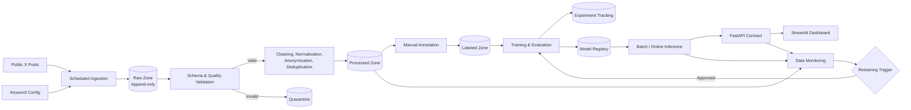

# Kuping Negara

> An MLOps-oriented sentiment intelligence platform proposal for monitoring
> public discourse on Indonesia's priority government programs.

Kuping Negara dirancang untuk membangun end-to-end machine learning lifecycle
yang reproducible, traceable, observable, dan maintainable. Sistem memproses
unggahan publik dari platform X, mengklasifikasikan sentimen ke dalam kelas
`positive`, `neutral`, atau `negative`, lalu menyajikan trend dan model
confidence melalui API serta dashboard.

> **Project status: Foundation Phase.** Repository structure, Python package,
> Dev Container, dependency specification, data contract draft, annotation
> guideline, smoke test, unit test, dan CI workflow sudah tersedia. Data
> ingestion, model training, model registry, serving API, dashboard, dan
> production monitoring masih berada dalam implementation roadmap.

## Table of Contents

- [Executive Summary](#executive-summary)
- [Project Proposal](#project-proposal)
  - [Background](#background)
  - [Problem Statement](#problem-statement)
  - [Research Questions](#research-questions)
  - [Objectives](#objectives)
  - [Stakeholders and Use Cases](#stakeholders-and-use-cases)
  - [System Scope](#system-scope)
  - [Key Deliverables](#key-deliverables)
- [Functional and Non-Functional Requirements](#functional-and-non-functional-requirements)
- [Solution Architecture](#solution-architecture)
- [Data Strategy](#data-strategy)
- [Machine Learning Strategy](#machine-learning-strategy)
- [MLOps Lifecycle](#mlops-lifecycle)
- [Technology Stack](#technology-stack)
- [Repository Structure](#repository-structure)
- [Quick Start](#quick-start)
  - [GitHub Codespaces](#github-codespaces)
  - [Local Development](#local-development)
- [Configuration](#configuration)
- [Testing and Quality Gates](#testing-and-quality-gates)
- [Development Workflow](#development-workflow)
- [Monitoring and Retraining](#monitoring-and-retraining)
- [Risk Register](#risk-register)
- [Success Metrics](#success-metrics)
- [Project Roadmap](#project-roadmap)
- [Ethics, Privacy, and Limitations](#ethics-privacy-and-limitations)
- [License](#license)

## Executive Summary

Percakapan mengenai program publik di social media berubah dengan cepat dan
mengandung variasi bahasa, konteks, sarkasme, spam, serta bias sampling. Analisis
sentimen yang hanya dilakukan sebagai eksperimen notebook tidak cukup karena
hasilnya sulit direproduksi, tidak memiliki data lineage, dan akan mengalami
degradasi ketika distribusi data berubah.

Proposal Kuping Negara menggunakan MLOps practices untuk mengelola keseluruhan
lifecycle: scheduled ingestion, immutable raw storage, schema validation,
preprocessing, manual annotation, experiment tracking, model registry,
controlled deployment, observability, dan retraining. Output sistem ditujukan
sebagai decision-support signal, bukan survei opini publik atau ukuran resmi
keberhasilan kebijakan.

## Project Proposal

### Background

Empat program yang menjadi initial monitoring scope adalah:

| Program ID | Program | Initial Collection Schedule |
| --- | --- | --- |
| `mbg` | Makan Bergizi Gratis | Monday |
| `ckg` | Cek Kesehatan Gratis | Tuesday |
| `kopdes_merah_putih` | Koperasi Desa Merah Putih | Wednesday |
| `sekolah_rakyat` | Sekolah Rakyat | Thursday |

Initial labeling dan data quality review direncanakan setiap Friday. Seluruh
scheduling menggunakan timezone `Asia/Jakarta`. Jadwal ini merupakan operating
proposal dan akan dievaluasi kembali berdasarkan volume data, rate limit,
latency, serta biaya operasional.

### Problem Statement

Project ini menjawab lima technical problems utama:

1. **Data freshness**: data harus dikumpulkan secara periodik tanpa menghasilkan
   duplicate record atau kehilangan run history.
2. **Data reliability**: source schema, volume, bahasa, dan kualitas teks dapat
   berubah tanpa pemberitahuan.
3. **Model reliability**: vocabulary drift, topic drift, dan sentiment drift
   dapat menurunkan performa model setelah deployment.
4. **Traceability**: prediction harus dapat ditelusuri ke source record,
   preprocessing version, dataset version, model version, dan code revision.
5. **Interpretability**: stakeholder membutuhkan trend, confidence, coverage,
   dan limitations yang dapat dipahami, bukan hanya sebuah class label.

### Research Questions

- Bagaimana membangun sentiment classification pipeline yang reproducible untuk
  Bahasa Indonesia dan percakapan social media yang dinamis?
- Seberapa baik baseline model dibandingkan Indonesian pretrained language
  model pada Macro-F1, per-class recall, calibration, dan inference cost?
- Monitoring signal apa yang paling efektif untuk mendeteksi degradation akibat
  data drift, concept drift, dan source schema change?
- Bagaimana menampilkan aggregate sentiment tanpa menghilangkan uncertainty dan
  tanpa menggeneralisasikan pengguna X sebagai seluruh masyarakat Indonesia?

### Objectives

#### Primary Objectives

- Menghasilkan weekly, versioned, dan quality-checked dataset untuk setiap
  target program.
- Mengembangkan three-class sentiment classifier dengan target Macro-F1 minimum
  `0.75` pada representative holdout set.
- Menyediakan batch inference dan online inference contract yang menyertakan
  class probabilities, confidence, dan model version.
- Menyediakan observability untuk data, model, pipeline, dan serving layer.
- Menetapkan controlled retraining dan rollback process yang dapat diaudit.

#### Engineering Objectives

- Menjaga source code modular di bawah satu Python namespace.
- Menjalankan environment yang konsisten melalui GitHub Codespaces/Dev
  Containers.
- Menggunakan automated tests dan CI sebagai minimum merge gate.
- Menjaga secrets, raw datasets, dan model binaries di luar Git history.
- Mendokumentasikan ownership, naming convention, code placement, dan Git
  workflow untuk contributor baru.

### Stakeholders and Use Cases

| Stakeholder | Primary Use Case | Expected Output |
| --- | --- | --- |
| Researcher/data analyst | Menganalisis perubahan discourse per program dan periode | Versioned dataset, trend, uncertainty |
| ML engineer | Melatih, membandingkan, dan mendaftarkan model | Metrics, artifacts, lineage, model card |
| Data engineer | Mengoperasikan ingestion dan validation pipeline | Run status, freshness, data quality report |
| Policy communication team | Memahami issue dan aggregate public response | Filtered dashboard dan explainable summary |
| Project maintainer | Menjaga quality, security, dan release process | CI status, PR review, rollback path |

### System Scope

#### In Scope

- Public posts yang diperoleh melalui collection method yang diizinkan.
- Program-specific keyword configuration dan scheduled collection.
- Raw, processed, dan labeled data zones.
- Bahasa Indonesia sebagai primary language; language detection tetap direkam.
- Manual annotation dengan `positive`, `neutral`, `negative`, dan temporary
  `uncertain` label untuk adjudication.
- Baseline model, transformer experiment, batch inference, REST API contract,
  dashboard, monitoring, serta retraining workflow.

#### Out of Scope

- Private messages, restricted data, atau bypass terhadap access control.
- Individual profiling, identity resolution, dan automated decision tentang
  seseorang.
- Causal inference mengenai keberhasilan program pemerintah.
- Klaim bahwa pengguna X merepresentasikan seluruh populasi Indonesia.
- Production deployment sebelum security, privacy, reliability, dan cost review.

### Key Deliverables

1. Reproducible development environment dan repository standard.
2. Config-driven ingestion pipeline dengan immutable raw zone.
3. Versioned data contract, validation report, dan preprocessing pipeline.
4. Annotation guideline, labeled dataset, serta inter-annotator agreement report.
5. Baseline dan candidate model comparison beserta experiment lineage.
6. Model registry, promotion gate, inference service, dan rollback procedure.
7. Monitoring dashboard untuk data quality, model quality, service health, dan
   pipeline health.
8. Technical documentation, operational runbook, dan assessment evidence.

## Functional and Non-Functional Requirements

### Functional Requirements

| ID | Requirement |
| --- | --- |
| `FR-01` | Sistem menerima keyword configuration per target program. |
| `FR-02` | Ingestion run menyimpan record secara append-only dan idempotent. |
| `FR-03` | Invalid record dikarantina dan dilaporkan sebelum processed zone. |
| `FR-04` | Preprocessing melakukan cleaning, normalization, anonymization, dan deduplication. |
| `FR-05` | Training pipeline merekam dataset, parameters, metrics, artifact, dan code version. |
| `FR-06` | Inference menghasilkan sentiment, probabilities, confidence, program, dan model version. |
| `FR-07` | Dashboard mendukung filter berdasarkan program dan time window. |
| `FR-08` | Monitoring mendeteksi data quality issue, drift, stale data, dan service failure. |

### Non-Functional Requirements

| Attribute | Initial Target |
| --- | --- |
| Reproducibility | Environment dan dependency dapat dibuat ulang dari repository. |
| Traceability | Prediction memiliki reference ke data/model/schema/run version. |
| Reliability | Scheduled pipeline success rate minimal `95%`. |
| Maintainability | Modular package, documented boundaries, automated tests, reviewed PR. |
| Security | Secrets tidak masuk Git; least-privilege access diterapkan pada runtime. |
| Privacy | Personal identifier diminimalkan sebelum downstream processing. |
| Observability | Structured logs, metrics, run status, dan alert context tersedia. |
| Recoverability | Model promotion memiliki previous-version rollback path. |

## Solution Architecture



Design principles:

- Raw data is immutable; corrections produce a new version.
- Pipeline stage communicates through explicit data contracts.
- DAG hanya mengatur orchestration dan tidak menyimpan business logic.
- Notebook hanya digunakan untuk exploration; reusable logic dipindahkan ke
  `src/kuping_negara/`.
- API dan dashboard menggunakan inference/service interface, bukan mengakses
  training internals.
- Model promotion membutuhkan evaluation evidence dan human approval.

## Data Strategy

### Data Zones

| Zone | Purpose | Storage Rule |
| --- | --- | --- |
| `raw` | Source-aligned ingestion output | Append-only, immutable, audit metadata required |
| `processed` | Cleaned, anonymized, normalized, deduplicated records | Must pass schema and quality gates |
| `labeled` | Annotated training/evaluation samples | Annotation guideline version required |
| `quarantine` | Invalid or suspicious records | Excluded until reviewed; planned storage |

Dataset contents are not committed to Git. The directories retain only
`.gitkeep`; large/versioned artifacts will use object storage and DVC or an
equivalent dataset registry.

### Data Contract

The initial JSON Schema is stored at
[`configs/schemas/tweet_record.schema.json`](configs/schemas/tweet_record.schema.json).
The main field groups are:

- identity: `tweet_id`, `conversation_id`, `tweet_url`;
- collection context: `target_program`, `matched_keyword`;
- text: `raw_text`, `cleaned_text`, `language`;
- temporal: `published_at`, `collected_at`, `year_week`, `year_month`;
- engagement: reply, repost/retweet, like, dan quote counts;
- annotation/inference: label, prediction, class probabilities, confidence;
- lineage: `ingestion_run_id`, `data_version`, `model_version`,
  `schema_version`.

### Data Quality Gates

- Required fields, data types, enum values, dan timestamp format valid.
- `tweet_id` uniqueness dan duplicate rate berada dalam accepted threshold.
- Probability value berada pada interval `[0, 1]`.
- Empty text, unsupported language, spam, dan anomalous volume dilaporkan.
- Source schema change menghasilkan explicit failure atau quarantine, bukan
  silent corruption.
- Personally identifiable information diminimalkan sebelum downstream use.

## Machine Learning Strategy

### Task Definition

Supervised multi-class text classification:

- `positive`: support, benefit, praise, atau positive experience terhadap
  target program;
- `neutral`: factual statement, announcement, question, atau tidak ada
  evaluative stance yang dominan;
- `negative`: criticism, rejection, complaint, atau negative experience;
- `uncertain`: temporary annotation state untuk ambiguity/adjudication dan
  tidak digunakan langsung sebagai target three-class training.

Full decision rules tersedia pada
[`docs/annotation-guidelines.md`](docs/annotation-guidelines.md).

### Experiment Plan

1. Build interpretable baseline menggunakan TF-IDF dan linear classifier.
2. Gunakan time-aware dan conversation-aware split untuk mengurangi leakage.
3. Ukur Macro-F1, per-class precision/recall/F1, confusion matrix, calibration,
   inference latency, dan model size.
4. Bandingkan baseline dengan IndoBERT/IndoBERTweet candidate.
5. Lakukan slice evaluation per program, period, dan language condition.
6. Simpan parameter, metric, artifact, dataset version, schema version, serta
   commit SHA di experiment tracker.
7. Register hanya candidate yang memenuhi quality gate dan documented review.

### Initial Model Acceptance Criteria

- Macro-F1 minimum `0.75` pada representative holdout set.
- Tidak ada critical class dengan recall yang berada di bawah threshold yang
  disepakati pada model review.
- Evaluation bebas known data leakage.
- Prediction contract menyertakan calibrated confidence atau limitation note.
- Model card, dataset reference, dan rollback artifact tersedia.

## MLOps Lifecycle

```text
Collect → Validate → Process → Label → Train → Evaluate → Register
       → Deploy → Monitor → Approve Retraining → Compare → Promote/Rollback
```

Every stage will produce machine-readable metadata. A model is never promoted
only because a single aggregate metric improves; regression by program,
calibration, operational cost, privacy, dan failure behavior harus ditinjau.

## Technology Stack

| Layer | Candidate Technology | Repository Status |
| --- | --- | --- |
| Language/runtime | Python 3.12+ | Configured |
| Development environment | GitHub Codespaces / Dev Containers | Configured |
| Package management | uv + committed lockfile | Configured |
| Data manipulation | pandas | Installed by project requirements |
| Baseline ML | scikit-learn | Installed by project requirements |
| NLP candidate | IndoBERT / IndoBERTweet | Planned experiment |
| Orchestration | Apache Airflow | Directory prepared |
| Data versioning | DVC + object storage | Planned |
| Experiment tracking | MLflow | Planned |
| API | FastAPI | Package boundary prepared |
| Metadata store | PostgreSQL | Planned |
| Dashboard | Streamlit | Package boundary prepared |
| Monitoring | Prometheus + Grafana | Planned |
| CI | GitHub Actions | Basic workflow configured |

`Planned` means architectural candidate, not an implemented production
component.

## Repository Structure

```text
kuping-negara/
├── .devcontainer/               # Codespaces/Dev Container definition
├── .github/                     # CI workflow and pull request template
├── .python-version              # Python version selected by uv
├── configs/
│   ├── keywords/                # Program keyword configuration
│   └── schemas/                 # Versioned data contracts
├── dags/                        # Airflow orchestration definitions only
├── data/
│   ├── raw/                     # Immutable source-aligned data; Git-ignored
│   ├── processed/               # Validated and transformed data; Git-ignored
│   └── labeled/                 # Annotated datasets; Git-ignored
├── docs/                        # Engineering, architecture, workflow, assessment
├── models/                      # Local model artifacts; Git-ignored
├── notebooks/                   # Exploration, EDA, and experiment narratives
├── pyproject.toml               # Direct dependency and package metadata
├── requirements.txt             # Generated pip compatibility manifest
├── src/kuping_negara/
│   ├── ingestion/               # Source adapters and raw persistence
│   ├── preprocessing/           # Text transformation and anonymization
│   ├── validation/              # Schema and data quality gates
│   ├── labeling/                # Annotation preparation and QA
│   ├── training/                # Training, evaluation, model registration
│   ├── inference/               # Batch and online prediction interfaces
│   ├── monitoring/              # Data/model/service monitoring
│   ├── api/                     # API transport layer
│   └── dashboard/               # Presentation layer
├── tests/
│   ├── unit/                    # Fast isolated tests
│   └── integration/             # Cross-component tests
└── uv.lock                      # Exact reproducible dependency resolution
```

Detailed ownership and code-placement rules are documented in
[`docs/project-structure.md`](docs/project-structure.md).

## Quick Start

### GitHub Codespaces

1. Open the repository on GitHub.
2. Select **Code → Codespaces → Create codespace on main**.
3. Wait until `postCreateCommand` completes.
4. Verify the locked environment:

```bash
uv sync --frozen --extra dev
uv pip check
uv run --frozen --extra dev python -m kuping_negara.healthcheck
```

5. Run the test suite:

```bash
uv run --frozen --extra dev pytest
```

Expected smoke-test output includes the project version and installed versions
of pandas, scikit-learn, JupyterLab, and pytest. The complete setup,
verification, rebuild, and troubleshooting procedure is available in
[`docs/codespaces-setup.md`](docs/codespaces-setup.md).

### Local Development

Prerequisites: Git and `uv`. The project pins Python 3.12 in
`.python-version`; `uv` can install that runtime when it is not already
available.

```bash
git clone https://github.com/ahmadnafi30/kuping-negara.git
cd kuping-negara
uv python install 3.12
uv sync --frozen --extra dev
uv pip check
uv run --frozen --extra dev python -m kuping_negara
uv run --frozen --extra dev pytest
```

`pyproject.toml` and `uv.lock` are the dependency source of truth.
`requirements.txt` is a generated compatibility export and is not the primary
installation path.

## Configuration

Copy the example environment file:

```powershell
Copy-Item .env.example .env
```

| Variable | Required | Description |
| --- | --- | --- |
| `X_AUTH_TOKEN` | When ingestion is implemented | Source access token; never commit it |
| `TZ` | Recommended | Scheduler timezone; default `Asia/Jakarta` |

Non-secret configuration belongs in `configs/`. Secret values belong in local
`.env`, Codespaces secrets, atau runtime secret manager. If a credential enters
Git history, deleting the file is insufficient: revoke/rotate the credential
and follow an approved history-remediation process.

## Testing and Quality Gates

Run locally:

```bash
uv sync --frozen --extra dev
uv pip check
uv run --frozen --extra dev python -m kuping_negara.healthcheck
uv run --frozen --extra dev pytest
```

Current CI runs dependency installation, environment health check, and unit
tests on supported branches and pull requests. Planned quality gates include:

- code formatting, linting, and static type checking;
- unit and integration tests;
- JSON Schema/data-contract validation;
- model metric and slice-regression tests;
- API contract tests;
- DAG parsing and container smoke tests;
- secret scanning and dependency vulnerability review.

## Development Workflow

Contributor rules:

- [`docs/development-guidelines.md`](docs/development-guidelines.md): naming,
  Python style, type hints, logging, testing, security, and Definition of Done.
- [`docs/project-structure.md`](docs/project-structure.md): code ownership,
  dependency boundaries, and where every file belongs.
- [`docs/git-workflow.md`](docs/git-workflow.md): branch lifecycle,
  Conventional Commits, Pull Request, review, merge, and cleanup.

Minimum contribution flow:

```bash
git switch develop
git pull --ff-only origin develop
git switch -c feat/short-kebab-case-description
# implement and test
git add <intentional-files>
git commit -m "feat: describe the capability in imperative form"
git push -u origin feat/short-kebab-case-description
```

Create a Pull Request into `develop`, wait for CI and review, merge, then delete
the topic branch. Release Pull Requests move verified changes from `develop`
into `main`. Do not create empty branches merely to demonstrate a prefix.

## Monitoring and Retraining

| Monitoring Domain | Initial Signals |
| --- | --- |
| Data quality | missing rate, duplicate rate, invalid schema, language mix, volume anomaly |
| Data drift | feature/vocabulary distribution, topic emergence, program distribution |
| Model quality | sampled Macro-F1, per-class recall, confidence, calibration |
| Service | latency, throughput, error rate, timeout, model version |
| Pipeline | success rate, duration, retry, freshness, late/missed schedule |

Retraining is proposed monthly or when approved drift/quality thresholds are
crossed. Candidate model must be compared with the active model and pass review.
Rollback must retain the previous production artifact and configuration.

## Risk Register

| Risk | Impact | Planned Mitigation |
| --- | --- | --- |
| Platform policy or source-access change | Ingestion interruption | Approved adapters, explicit failures, documented fallback |
| Sampling bias | Misleading interpretation | Coverage disclosure, no population-level claim |
| Vocabulary/topic drift | Model degradation | Drift monitoring, audit sampling, scheduled review |
| Annotation disagreement | Noisy ground truth | Versioned guideline, double annotation, adjudication |
| Sensitive information exposure | Privacy/security incident | Data minimization, anonymization, access control, no raw data in Git |
| Data leakage | Inflated evaluation | Time/conversation-aware split and lineage checks |
| Low-confidence prediction | Poor decision support | Probability output, threshold policy, abstention/review path |
| Pipeline silently succeeds with bad data | Corrupted downstream output | Schema gate, quarantine, alerting, run-level metrics |

## Success Metrics

| Category | Metric | Initial Target |
| --- | --- | --- |
| Model | Macro-F1 | `>= 0.75` on representative holdout data |
| Pipeline | Scheduled run success rate | `>= 95%` |
| Freshness | Program data and summary update | Weekly |
| Traceability | Prediction linked to run/data/model/schema version | `100%` |
| Usability | Test users understand primary dashboard insight | `>= 80%` |

These values are acceptance targets, not achieved results. Every report must
include dataset period, sample size, split strategy, label distribution, and
known limitations.

## Project Roadmap

- [x] Standardize repository structure and Python namespace.
- [x] Configure Codespaces/Dev Container, uv lockfile, and core dependencies.
- [x] Add `.gitignore`, environment example, license, smoke test, unit test, CI.
- [x] Add keyword configuration sample and initial data contract.
- [x] Add initial annotation guideline.
- [x] Document engineering standards, project structure, and Git/PR workflow.
- [ ] Implement idempotent and policy-compliant ingestion.
- [ ] Implement raw-to-processed validation and preprocessing.
- [ ] Produce labeled dataset and agreement report.
- [ ] Train/evaluate scikit-learn baseline.
- [ ] Compare Indonesian transformer candidates.
- [ ] Add DVC, MLflow, and Airflow workflow.
- [ ] Implement FastAPI prediction contract and Streamlit dashboard.
- [ ] Add production monitoring, alerting, and retraining controls.
- [ ] Complete security/privacy review and deployment readiness review.

## Ethics, Privacy, and Limitations

- Process only data that may legally and contractually be accessed.
- Follow platform terms, institutional policy, and applicable regulation.
- Minimize or pseudonymize personal identifiers before downstream processing.
- Never commit authentication headers, cookies, tokens, or raw personal data.
- Do not use the system for individual profiling or automated individual action.
- Disclose that X users are not a representative sample of Indonesia.
- Present uncertainty and error; sentiment prediction is not verified fact.
- Maintain audit, correction, rollback, retention, and deletion procedures.

## License

Source code is licensed under the [MIT License](LICENSE). The repository license
does not grant redistribution rights for third-party datasets. Data use remains
subject to source permission, platform terms, and applicable policy.
